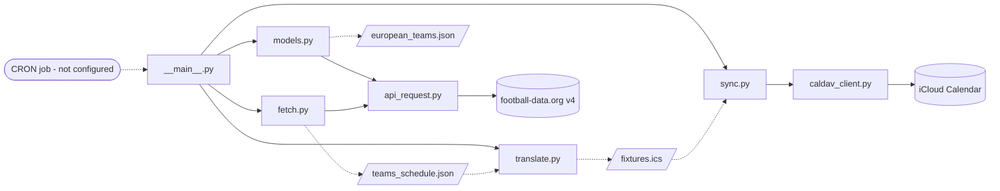

# soccer-match-calendar-importer

Automatically imports the dates and times of soccer matches for a specific team
into an Apple calendar.

Schedule data comes from [football-data.org](https://www.football-data.org/)
(API v4). A run fetches the team's upcoming fixtures, translates them into
iCalendar events, and syncs them to an iCloud calendar over CalDAV. A CRON job
to run it weekly is not configured yet.

## Project status

The pipeline works end to end. `python -m src` fetches real fixtures and writes
them to a live iCloud calendar.

| Module | State | Purpose |
| --- | --- | --- |
| `api_request.py` | **Working** | HTTPS transport, auth, query encoding, error handling |
| `models.py` | **Working** | Team name to team id maps for the top 5 European leagues |
| `fetch.py` | **Working** | Upcoming fixtures for one team, pruned to the fields a calendar needs |
| `translate.py` | **Working** | Fixtures into `ics` calendar events |
| `caldav_client.py` | **Working** | Authenticated CalDAV connection to iCloud |
| `sync.py` | **Working** | Upsert events into the target calendar |
| `__main__.py` | **Working** | Runner; wires the four stages together |
| `CRON/` | Empty | No schedule configured |

## How it works



Solid arrows are calls; dotted arrows are files on disk.

`fetch` and `models` both build a resource path plus a dict of query parameters
and hand them to `api_request.make_request`, which is the only module that knows
about HTTP, the API host, or the auth token. `caldav_client` plays the same role
for iCloud: it owns credentials and the server URL, and `sync` owns what gets
written.

### Season handling

football-data.org labels a season by the calendar year it starts in. A European
season including international competitions runs into July, so the cutover is
1 August: from August onwards the season is the current year, otherwise it is
the previous year. This lives in `models.get_teams`.

### First run versus refresh

`fetch_fixtures` takes an `initial_run` flag, and `__main__` picks which to use:

- **No cached schedule** — asks for every `SCHEDULED` match the API will give,
  seeding the whole season.
- **Cached schedule present** — asks only for today through two weeks out, and
  merges the result over the cache.

The merge matters because kickoff times are announced a few weeks ahead. A
refresh corrects placeholder times, adds newly scheduled matches, and leaves
everything outside the window untouched: absent from a two-week refresh means
out of range, not cancelled.

Match ids are normalised to strings before merging. `fetch` returns them as
ints and the JSON cache reloads them as strings, so merging without that would
file one match under both `564650` and `"564650"`.

### Stable event identity

Every event's `UID` is `{match_id}@soccer-match-calendar-importer`, built from
football-data.org's own match id. That id is the only field that survives a
reschedule, which is what makes re-runs safe: a moved match updates in place
instead of appearing twice.

Duplicates are prevented twice over. `sync` lists the calendar and indexes it by
UID before writing, so an existing match takes the update path. Independently,
`caldav` derives each resource URL from the UID, so even a lookup that wrongly
reported an event as missing would PUT to the same address and overwrite.

**Do not change `UID_DOMAIN` in `translate.py` after the first real sync.** New
UIDs would orphan every existing event and duplicate the whole calendar.

### Unannounced kickoff times

Leagues confirm broadcast slots a few weeks out, so most fixtures arrive with a
kickoff of `00:00:00Z` — the API's placeholder for "not scheduled yet". Left
alone those land in the calendar at 2am, so `translate.apply_default_kickoff`
parks them at **3:00pm America/New_York**, keeping the real match date.

The zone is used rather than a fixed `-05:00` offset so the event reads as 3pm
on the wall clock through both halves of the season; a fixed offset would drift
to 4pm during EDT. No real fixture kicks off at midnight UTC — 1am in England,
2am in Spain — so the sentinel is safe to test for.

Nothing in the event marks these times as provisional. A weekly refresh corrects
them as slots get announced.

### One resource per event

CalDAV stores every event as its own resource at its own URL, so `sync` splits
`fixtures.ics` back into one complete `VCALENDAR` per match before writing.

The split is rebuilt with `icalendar` rather than re-serialised through `ics`,
because `icalendar` folds lines at the 75-octet limit RFC 5545 requires and
ics.py 0.7 does not. A Champions League draw against a long German club name is
enough to push a `SUMMARY` over that limit.

`sync` only ever adds or updates. It never deletes, so a cancelled fixture stays
in the calendar.

## Setup

Requires Python 3.9 or newer.

```
python3 -m venv .venv
.venv/bin/pip install --upgrade pip
.venv/bin/pip install -e . --group dev
```

The `--upgrade pip` step matters: `--group` needs pip 25.1 or newer, and a
fresh venv on macOS ships an older one.

### Credentials

Put all three in a `.env` file in the repo root:

```
FOOTBALL_DATA_KEY=your_token_here
ICLOUD_ID=you@example.com
ICLOUD_PASSWORD=abcd-efgh-ijkl-mnop
```

`FOOTBALL_DATA_KEY` is a free token from
[football-data.org/client/register](https://www.football-data.org/client/register).

`ICLOUD_PASSWORD` must be an **app-specific password** generated at
[appleid.apple.com](https://appleid.apple.com) under Sign-In and Security. iCloud
rejects a plain Apple ID password over CalDAV whenever two-factor authentication
is on, which it is for every modern account.

`.env` is gitignored. Never commit any of these.

### The calendar

Create it by hand in Calendar.app: **File → New Calendar**, and pick **iCloud**
from the account submenu. An "On My Mac" calendar is a local file with no
presence on Apple's servers, so CalDAV cannot see it. Name it `Soccer` to match
`sync.CALENDAR_NAME`, or change the constant.

`caldav_client.get_calendar` deliberately does not create the calendar. iCloud's
support for `MKCALENDAR` is unreliable, and a typo silently creating a second
calendar is worse than failing with a list of the names that do exist.

To check what the server actually sees:

```python
from src.caldav_client import connect
for calendar in connect().principal().calendars():
    print(repr(calendar.name))
```

Watch for a trailing space; `'Soccer '` and `'Soccer'` are different calendars.
A **subscribed** calendar added by URL is read-only over CalDAV and will fail on
write.

## Usage

```
python -m src              # fetch, translate, and sync to iCloud
python -m src --dry-run    # everything except writing to the calendar
```

Start with `--dry-run`. It exercises auth, calendar lookup and the whole
transform, reports the exact create/update split it would perform, and writes
nothing.

Three files are written to the repo root, all gitignored:

- `european_teams.json` — team name to id for all 5 leagues, ~96 teams
- `teams_schedule.json` — the target team's fixtures, keyed by match id
- `fixtures.ics` — every fixture as one iCalendar file

`european_teams.json` is fetched once and reused. `teams_schedule.json` is
refreshed on every run once it exists. Delete either to rebuild it from scratch.

The target team is `TEAM_NAME` in `__main__.py`, looked up across all five
leagues. Names must match `european_teams.json` exactly — `"FC Barcelona"`, not
`"Barcelona"`.

## Data source and limits

Team lookups are limited to the top 5 European leagues:

| Code | League |
| --- | --- |
| `PD` | La Liga |
| `PL` | Premier League |
| `FL1` | Ligue 1 |
| `BL1` | Bundesliga |
| `SA` | Serie A |

These five are the whole of `models.LEAGUE_CODES`, and the only competitions
`get_teams()` queries. The free tier does make eight more available — Eredivisie,
Primeira Liga, the Championship, Champions League, the European Championship,
the World Cup, Campeonato Brasileiro and Copa Libertadores — but none are used;
adding one means adding its code to that dict.

Two constraints worth knowing:

- **10 requests per minute.** `get_teams()` makes 5, one per league. Every code
  added to `LEAGUE_CODES` is another request against that ceiling. A normal run
  with both caches present makes exactly one request.
- **Fixtures are not restricted to those 5 leagues.** `fetch_fixtures` asks for
  a team's matches directly rather than by competition, so it returns every
  match the free tier can see — a La Liga side's Champions League fixtures
  included. Domestic cups are not covered at all, so Copa del Rey, Supercopa and
  Europa League matches will simply be absent rather than raising an error.

## Tests

```
.venv/bin/python -m pytest
```

110 tests, no network access and no calendar access. `http.client.HTTPSConnection`
is replaced with an in-memory fake, `load_dotenv` is stubbed out, and the CalDAV
calendar is a local double, so the suite never reads the real `.env`, spends rate
limit, or touches iCloud.

- `tests/test_fetch.py` — request construction, auth header, error statuses,
  connection lifetime, missing-token handling, both date-window modes, and the
  match-id keying reschedules depend on
- `tests/test_models.py` — team extraction, payload-shape guard, per-league
  request shape, season cutover
- `tests/test_translate.py` — timestamp parsing, the unannounced-kickoff default
  across both DST halves, event fields, and CRLF line endings
- `tests/test_sync.py` — splitting into per-event documents, line folding,
  create versus update, and that a second run cannot duplicate
- `tests/test_main.py` — team lookup across leagues, cache reuse, and the
  refresh merge including the int/string key trap

The CalDAV double in `test_sync.py` deliberately does **not** implement
`event_by_uid`, because iCloud answers that query with `412 Precondition Failed`.
Any code reaching for it fails in the suite rather than in production.

## Not yet built

- **`CRON/` is empty.** No schedule is configured.
- **Cancelled matches linger.** `sync` never deletes, so a fixture that
  disappears stays in the calendar. Handling it safely needs the full-season
  list rather than a two-week window.
- **Every run rewrites every event.** `translate.to_event` sets `DTSTAMP` to the
  current time, so no generated document ever matches the stored one and each
  sync bumps `SEQUENCE` on all of them. Worth fixing before the job runs weekly.
- **Provisional times are unmarked.** An event defaulted to 3pm looks exactly as
  authoritative as a confirmed kickoff.
- **A second team would collide.** UIDs come from the match id alone, so syncing
  two teams to one calendar makes a head-to-head fixture a single event whose
  wording depends on which ran last. Folding the team id into the UID would fix
  it, but only before a first real sync.
