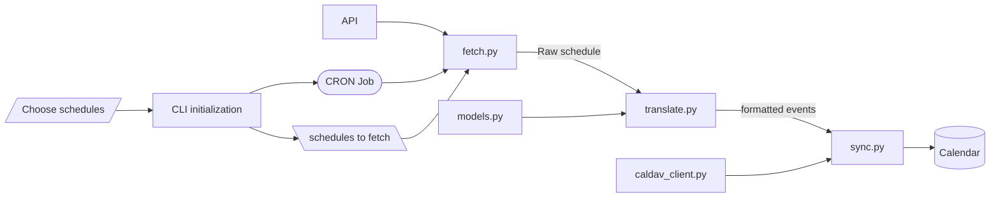

# soccer-match-calendar-importer
Automatically imports the dates and times of soccer matches for a specific team onto apple calendar. 

# Architecture

The system pulls schedule data for every competition a team is in from [api-football.com](https://www.api-football.com/) every week. Once setup is complete, a CRON job is responsible for triggering the runner file. The runner invokes the `fetch` module to fetch the schedule data. Once the data is in memory, the `translate` module translates the raw api-football data to a list of formatted calendar events with the `ics` library. The `sync` module then imports these events into the specified icloud calendar with `caldav`.

