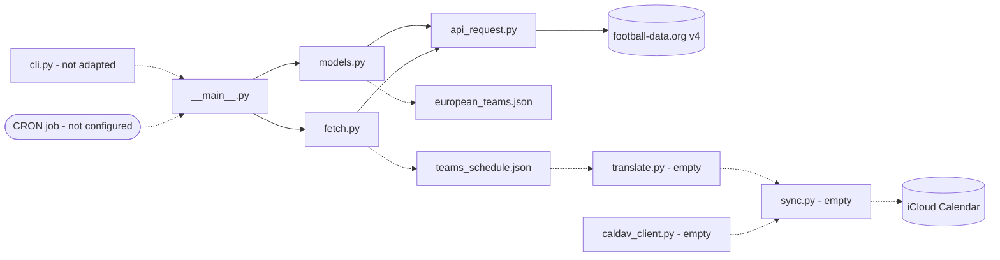

# soccer-match-calendar-importer

Automatically imports the dates and times of soccer matches for a specific team
into an Apple calendar.

Schedule data comes from [football-data.org](https://www.football-data.org/)
(API v4). A CRON job runs the package weekly; it fetches the team's upcoming
fixtures, translates them into calendar events, and syncs them to an iCloud
calendar over CalDAV.

## Project status

The data-fetching half is working. The calendar half is not yet built.

| Module | State | Purpose |
| --- | --- | --- |
| `api_request.py` | **Working** | HTTPS transport, auth, query encoding, error handling |
| `fetch.py` | **Working** | Upcoming fixtures for one team over a two-week window |
| `models.py` | **Working** | Team name to team id maps for the top 5 European leagues |
| `__main__.py` | **Working** | Runner; writes both payloads to JSON on disk |
| `translate.py` | Empty | Turn raw match data into `ics` calendar events |
| `sync.py` | Empty | Push events into the target calendar |
| `caldav_client.py` | Empty | CalDAV connection to iCloud |
| `cli.py` | Not adapted | Still argparse boilerplate from an unrelated project |

Running `python -m src` today fetches real data and caches it. It does not yet
touch a calendar.

## How it works

Both `fetch` and `models` build a resource path plus a dict of query parameters
and hand them to `api_request.make_request`, which is the only module that knows
about HTTP, the API host, or the auth token.



Solid arrows are implemented; dotted arrows are not yet.

### Season handling

football-data.org labels a season by the calendar year it starts in. A European
season including international competitions runs into July, so the cutover is
1 August: from August onwards the season is the current year, otherwise it is
the previous year. This lives in `models.get_teams`.

### Date window

`fetch_fixtures` asks for `SCHEDULED` matches from today to two weeks out, using
UTC dates to match the API's own clock.

## Setup

Requires Python 3.9 or newer.

```
python3 -m venv .venv
.venv/bin/pip install --upgrade pip
.venv/bin/pip install -e . --group dev
```

The `--upgrade pip` step matters: `--group` needs pip 25.1 or newer, and a
fresh venv on macOS ships an older one.

Get a free API token from
[football-data.org/client/register](https://www.football-data.org/client/register)
and put it in a `.env` file in the repo root:

```
FOOTBALL_DATA_KEY=your_token_here
```

No spaces around the `=` and no quotes. `python-dotenv` tolerates both, but
shell one-liners that read the file with `cut` do not.

`.env` is gitignored. Never commit the token.

## Usage

```
python -m src
```

On first run this writes two files to the repo root:

- `european_teams.json` — team name to id for all 5 leagues, ~96 teams
- `teams_schedule.json` — the target team's scheduled matches for the next 2 weeks

Both are skipped if the file already exists, so repeat runs cost no API
requests. Delete a file to refresh it.

The target team is currently hardcoded as `81` (FC Barcelona) in `__main__.py`.
Look up other ids in `european_teams.json`.

## Data source and limits

Team lookups are limited to the top 5 European leagues:

| Code | League |
| --- | --- |
| `PD` | La Liga |
| `PL` | Premier League |
| `FL1` | Ligue 1 |
| `BL1` | Bundesliga |
| `SA` | Serie A |

These five are the whole of `models.LEAGUE_CODES`, and the only competitions
`get_teams()` queries. The free tier does make eight more available — Eredivisie,
Primeira Liga, the Championship, Champions League, the European Championship,
the World Cup, Campeonato Brasileiro and Copa Libertadores — but none are used;
adding one means adding its code to that dict.

Two constraints worth knowing:

- **10 requests per minute.** `get_teams()` makes 5, one per league. Every code
  added to `LEAGUE_CODES` is another request against that ceiling.
- **Fixtures are not restricted to those 5 leagues.** `fetch_fixtures` asks for
  a team's matches directly rather than by competition, so it returns every
  match the free tier can see — a La Liga side's Champions League fixtures
  included. Domestic cups are not covered at all, so Copa del Rey, Supercopa and
  Europa League matches will simply be absent rather than raising an error.

## Tests

```
.venv/bin/python -m pytest
```

30 tests, no network access. `http.client.HTTPSConnection` is replaced with an
in-memory fake and `load_dotenv` is stubbed out, so the suite never reads the
real `.env` or spends rate limit.

- `tests/test_fetch.py` — request construction, auth header, error statuses,
  connection lifetime, missing-token handling
- `tests/test_models.py` — team extraction, payload-shape guard, per-league
  request shape, season cutover

## Not yet built

- `translate.py`, `sync.py`, `caldav_client.py` — the entire calendar half
- `cli.py` — needs rewriting for this project's arguments
- `CRON/` — empty; no schedule is configured yet
